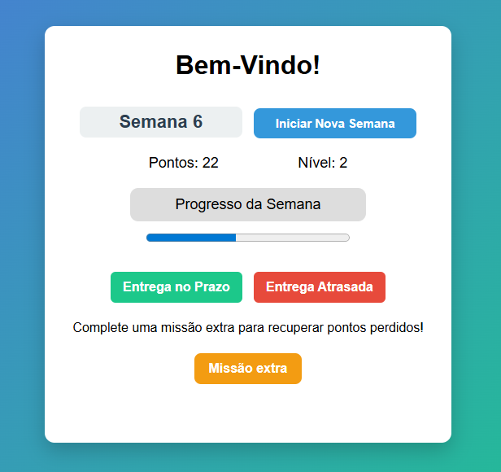

# 🎮 Gamification System

Front-End project developed based on gamification concepts, applying elements such as scoring, progress tracking and user motivation to improve engagement in learning activities.

## 🧠 What is Gamification?

Gamification is the use of game elements in non-game contexts to increase user engagement and motivation.

## 📸 Project Preview

## 🛠️ Technologies

- HTML
- CSS
- JavaScript

## ⚙️ Features

- Score tracking system  
- Real-time user feedback  
- Reward-based interaction  
- Progress indicators  

## 🎯 Project Goal

Apply gamification concepts to enhance user engagement through a system based on rewards, feedback and progression.

## 📚 Context

Academic project focused on the practical application of gamification concepts.

## 👨‍💻 Author

Luis Francisco